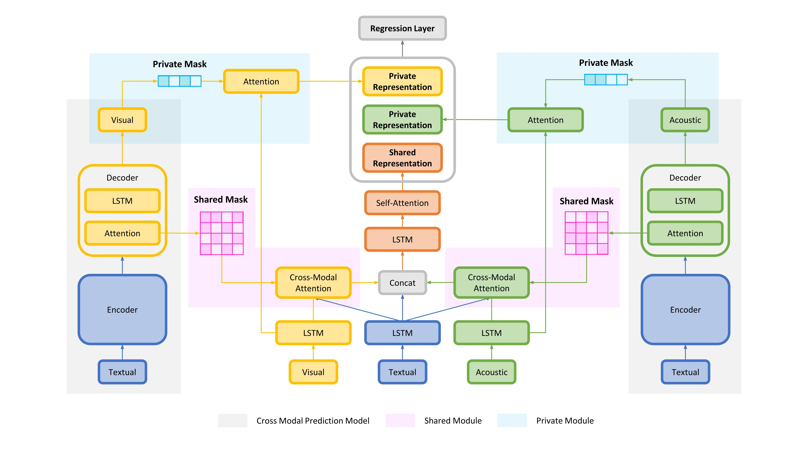

# TCSP

Code for Findings of ACL 2021 paper: *[A Text-Centered Shared-Private Framework via Cross-Modal Prediction for Multimodal Sentiment Analysis](https://aclanthology.org/2021.findings-acl.417/)*




## Dependencies

* Python 3.6.8
* PyTorch 1.3.1
* Numpy 1.19.2
* CUDA 10.1


## Getting Start

Hi, if you are familiar to *[git](https://git-scm.com/)*,  you can easily clone this project via:

```bash
git clone https://github.com/lzjjeff/TCSP.git
cd TCSP
```

Then, you can create a runnable *[conda](https://www.anaconda.com/)* environment via:

```bash
conda env create -f environment.yml
source activate && conda activate tcsp
```

Next, creating some necessary folds via:
```bash
mkdir data && cd data
mkdir MOSI MOSEI && cd ../
mkdir save && cd save
mkdir mosi mosei && cd ../
```


## Data

We evaluate our model on two benchmarks MOSI and MOSEI.

The data for experiment are placed in `./data/`, you can download the processed MOSI and MOSEI datasets from:

| Dataset | Link1                                                        |
| ------- | ------------------------------------------------------------ |
| MOSI    | *[GoogleDrive](https://drive.google.com/file/d/15hQVBJ0MJZVDU8MA_smyccgAVXedMABL/view?usp=sharing)* |
| MOSEI   | *[GoogleDrive](https://drive.google.com/file/d/1b17EAnEwTwsrEwqrR6Nj6goz54mXB4_1/view?usp=sharing)* |

and place them to `./data/MOSI/` and`./data/MOSEI` .

For more specific introduction about the two datasets, please refer to *[CMU-MultimodalSDK](https://github.com/A2Zadeh/CMU-MultimodalSDK)*.


## Train & Test

We use a pipeline approach to train the translation model and the regression model.

### All in one

Take MOSEI as an example, you can train and test the two model at once via:

```bash
export DATASET=mosei
python run_tcsp.py \
--dataset ${DATASET} \
--batch_size 24 \
--do_trans \
--do_regre \
--trans_save_path ./save/${DATASET}/trans/ \
--regre_save_path ./save/${DATASET}/regre/ \
--device_ids 0 \
--trans_epoch 40 \
--trans_hidden_size 100 \
--trans_lr 1e-3
--regre_epoch 30 \
--regre_lr 1e-3 \
--regre_mask_topk 5 \
--regre_use_mi \
--regre_use_mp \
--regre_mi_mask_type topk \
--regre_mp_mask_type topk \
--regre_hidden_size 100
```

The trained models and test results are saved in `trans_save_path` and `regre_save_path`.

### Step by Step

If you want to train the two models separately, you can first train the translation model via:

```bash
export DATASET=mosei
python run_tcsp.py \
--dataset ${DATASET} \
--batch_size 24 \
--do_trans \
--trans_save_path ./save/${DATASET}/trans/ \
--device_ids 0 \
--trans_epoch 40 \
--trans_hidden_size 100 \
--trans_lr 1e-3
```

After above step finished, train and test the regression model via:

```bash
export DATASET=mosei
python run_tcsp.py \
--dataset ${DATASET} \
--batch_size 24 \
--do_regre \
--trans_save_path ./save/${DATASET}/trans/ \	 # for reading the trained translation model
--regre_save_path ./save/${DATASET}/regre/ \
--device_ids 0 \
--regre_epoch 30 \
--regre_lr 1e-3 \
--regre_mask_topk 5 \
--regre_use_mi \
--regre_use_mp \
--regre_mi_mask_type topk \
--regre_mp_mask_type topk \
--regre_hidden_size 100 \
--trans_hidden_size 100 \	# required to match the translation setting
```

You can find more details about hyper-parameters in `util.py`.


## Results on MOSI & MOSEI

TCSP performance on MOSI & MOSEI test set. The evaluation metrics are:

* Classification metrics: *binary accuracy* (Acc), *weighted F1-score* (F1)
* Regression metrics: *mean absolute error* (MAE), *correlation* (Corr)

|       | Acc  |  F1  |  MAE  | Corr  |
| :---: | :--: | :--: | :---: | :---: |
| MOSI  | 80.9 | 81.0 | 0.908 | 0.710 |
| MOSEI | 82.8 | 82.6 | 0.576 | 0.715 |


## Citation

